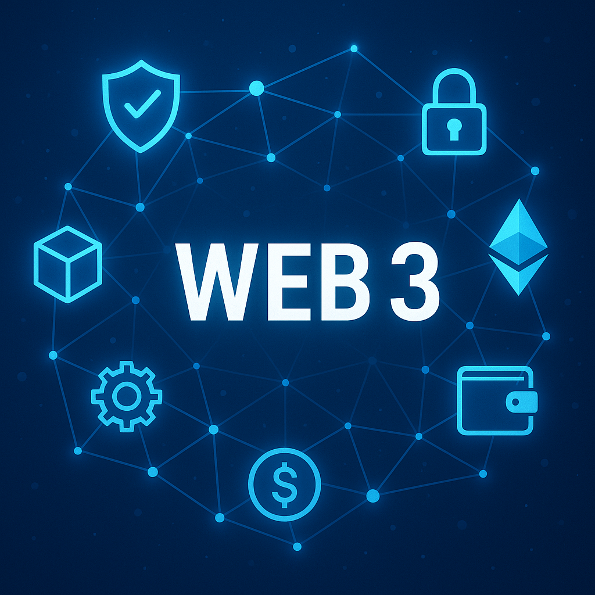

# CrossDapp Passkey Portal

A revolutionary authentication solution for the Stellar ecosystem that combines device-native passkeys with smart contract capabilities to create a seamless, secure, and interoperable authentication system.

## 🌟 Features

- **One Passkey, Every Dapp**: Use a single passkey across all Stellar dapps
- **Smart Wallet Integration**: Automated transaction handling with smart contracts
- **Seamless UX**: Web2-like experience with Web3 security
- **Cross-dapp Interoperability**: Move between dapps without re-authentication

## 🚀 Getting Started

### Prerequisites

- Node.js 18+ and npm
- Rust and Cargo (for smart contract development)
- Stellar Testnet account

### Installation

1. Clone the repository:
   ```bash
   git clone https://github.com/Azlan-A1/crossdapp-passkey-portal.git
   cd crossdapp-passkey-portal
   ```

2. Install frontend dependencies:
   ```bash
   cd frontend
   npm install
   ```

3. Start the development server:
   ```bash
   npm run dev
   ```

4. Open [http://localhost:3000](http://localhost:3000) in your browser.

## 🏗️ Project Structure

```
crossdapp-passkey-portal/
├── contracts/        # Rust Soroban smart contracts
├── frontend/         # Next.js frontend application
├── sdk/             # JavaScript SDK for dapp integration
└── docs/            # Technical documentation
```

## 🖼️ Screenshots

### OrbitPass landing page


### Registering a passkey with OrbitPass


### Authenticating with a passkey


### Successful passkey registration and authentication


### Error handling in OrbitPass


## 🔧 Development

### Frontend

The frontend is built with Next.js 14 and TailwindCSS, featuring:
- Dark mode by default
- Responsive design
- Framer Motion animations
- Modern UI components

### Smart Contracts

The smart contracts are written in Rust using Soroban:
- Passkey vault management
- Smart wallet policies
- Cross-dapp consent ledger
- Escrow logic

### SDK

The JavaScript SDK provides easy integration for dapp developers:
- Passkey authentication
- Transaction signing
- Smart wallet management
- Cross-dapp communication

## 📚 Documentation

- [Technical Documentation](/docs)
- [API Reference](/docs/api)
- [Smart Contract Guide](/docs/contracts)
- [Integration Guide](/docs/integration)

## 🎯 Demo Applications

- [Token Swap Demo](/demo/token-swap)
- [Tipping Demo](/demo/tipping)

## 🤝 Contributing

1. Fork the repository
2. Create your feature branch (`git checkout -b feature/amazing-feature`)
3. Commit your changes (`git commit -m 'Add some amazing feature'`)
4. Push to the branch (`git push origin feature/amazing-feature`)
5. Open a Pull Request

## 📝 License

This project is licensed under the MIT License - see the [LICENSE](LICENSE) file for details.

## 🙏 Acknowledgments

- Stellar Development Foundation
- Soroban Team
- WebAuthn Community
- All contributors and supporters

## 📞 Contact

- Project Link: [https://github.com/Azlan-A1/crossdapp-passkey-portal](https://github.com/Azlan-A1/crossdapp-passkey-portal)
- Hackathon Submission: [Stellar Consensus Hackathon 2025](https://stellar.org/developers/hackathon) 